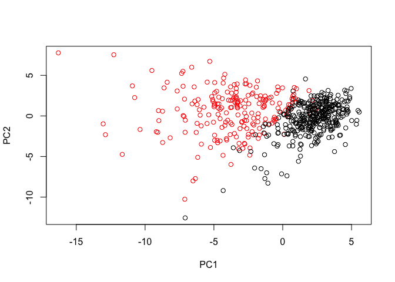
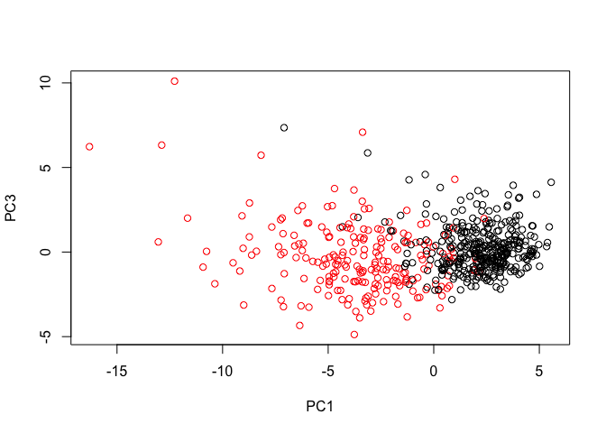
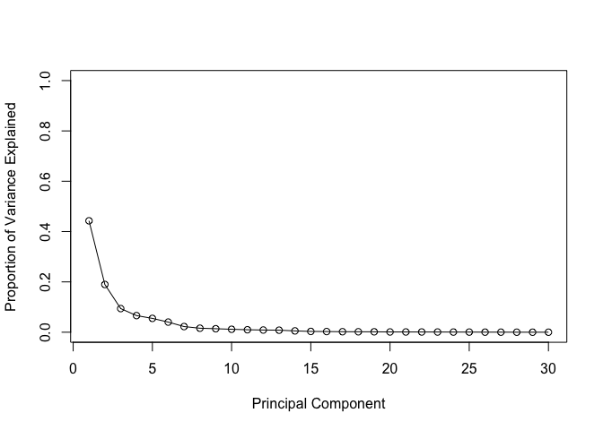
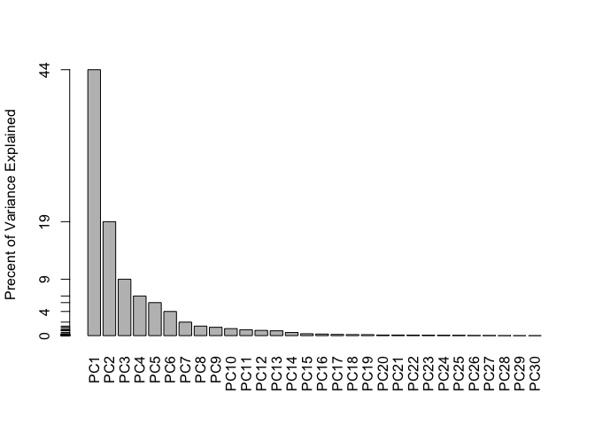
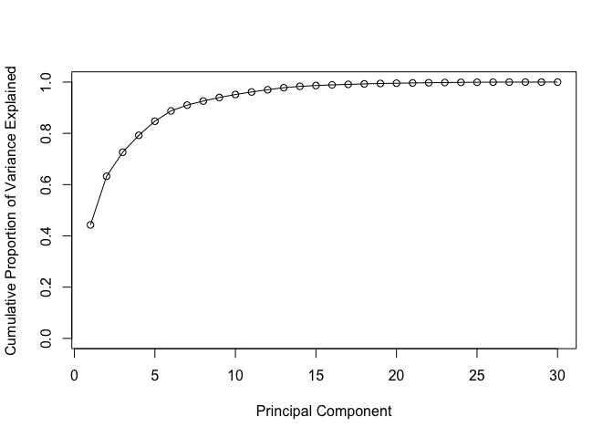
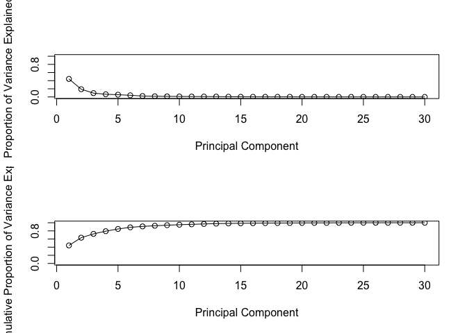
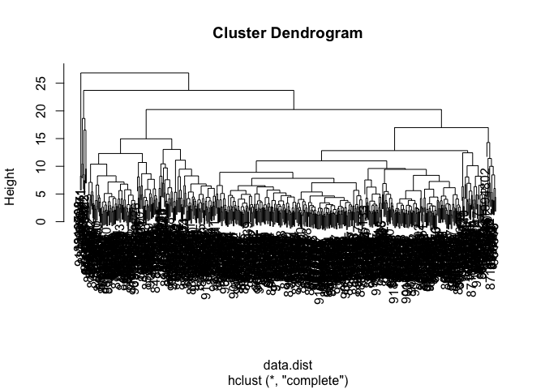
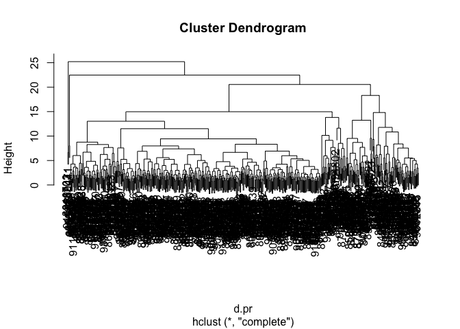
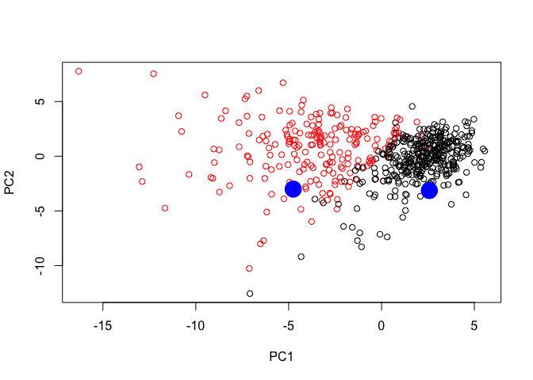

PCA mini project
================
Neha Patel
October 30, 2018

``` r
# import csv file as url
url <- "https://bioboot.github.io/bimm143_S18/class-material/WisconsinCancer.csv"

# import and store data as wisc.df
wisc.df <- read.csv(url)

# convert data into a matrix for columns 3->32
wisc.data <- as.matrix(wisc.df[,3:32] )

# set row names of wisc.data
row.names(wisc.data) <- wisc.df$id

# set a vector diagnosis to be equal to 1 if "M" and 0 otherwise 
diagnosis <- as.numeric(wisc.df$diagnosis == "M")
  # sets diagnosis == "M" so that it will return a 1 if it is malignant
# checking if diagnosis is "M" when you put == 
# find colnames = "_mean"
# use grep function
 x <- length(grep("_mean", colnames(wisc.data)))
# finding length of the vector gives you the number of IDs with _mean
```

There are 10 mean measurements in this dataset.

``` r
# check if data needs to be scaled before PCA 
# mean of set 
colMeans(wisc.data)
```

    ##             radius_mean            texture_mean          perimeter_mean 
    ##            1.412729e+01            1.928965e+01            9.196903e+01 
    ##               area_mean         smoothness_mean        compactness_mean 
    ##            6.548891e+02            9.636028e-02            1.043410e-01 
    ##          concavity_mean     concave.points_mean           symmetry_mean 
    ##            8.879932e-02            4.891915e-02            1.811619e-01 
    ##  fractal_dimension_mean               radius_se              texture_se 
    ##            6.279761e-02            4.051721e-01            1.216853e+00 
    ##            perimeter_se                 area_se           smoothness_se 
    ##            2.866059e+00            4.033708e+01            7.040979e-03 
    ##          compactness_se            concavity_se       concave.points_se 
    ##            2.547814e-02            3.189372e-02            1.179614e-02 
    ##             symmetry_se    fractal_dimension_se            radius_worst 
    ##            2.054230e-02            3.794904e-03            1.626919e+01 
    ##           texture_worst         perimeter_worst              area_worst 
    ##            2.567722e+01            1.072612e+02            8.805831e+02 
    ##        smoothness_worst       compactness_worst         concavity_worst 
    ##            1.323686e-01            2.542650e-01            2.721885e-01 
    ##    concave.points_worst          symmetry_worst fractal_dimension_worst 
    ##            1.146062e-01            2.900756e-01            8.394582e-02

``` r
# standard deviation
apply(wisc.data, 2, sd)
```

    ##             radius_mean            texture_mean          perimeter_mean 
    ##            3.524049e+00            4.301036e+00            2.429898e+01 
    ##               area_mean         smoothness_mean        compactness_mean 
    ##            3.519141e+02            1.406413e-02            5.281276e-02 
    ##          concavity_mean     concave.points_mean           symmetry_mean 
    ##            7.971981e-02            3.880284e-02            2.741428e-02 
    ##  fractal_dimension_mean               radius_se              texture_se 
    ##            7.060363e-03            2.773127e-01            5.516484e-01 
    ##            perimeter_se                 area_se           smoothness_se 
    ##            2.021855e+00            4.549101e+01            3.002518e-03 
    ##          compactness_se            concavity_se       concave.points_se 
    ##            1.790818e-02            3.018606e-02            6.170285e-03 
    ##             symmetry_se    fractal_dimension_se            radius_worst 
    ##            8.266372e-03            2.646071e-03            4.833242e+00 
    ##           texture_worst         perimeter_worst              area_worst 
    ##            6.146258e+00            3.360254e+01            5.693570e+02 
    ##        smoothness_worst       compactness_worst         concavity_worst 
    ##            2.283243e-02            1.573365e-01            2.086243e-01 
    ##    concave.points_worst          symmetry_worst fractal_dimension_worst 
    ##            6.573234e-02            6.186747e-02            1.806127e-02

``` r
# Perform PCA on wisc.data by completing the following code 
wisc.pr <- prcomp(wisc.data, scale=TRUE)
summary(wisc.pr)
```

    ## Importance of components:
    ##                           PC1    PC2     PC3     PC4     PC5     PC6
    ## Standard deviation     3.6444 2.3857 1.67867 1.40735 1.28403 1.09880
    ## Proportion of Variance 0.4427 0.1897 0.09393 0.06602 0.05496 0.04025
    ## Cumulative Proportion  0.4427 0.6324 0.72636 0.79239 0.84734 0.88759
    ##                            PC7     PC8    PC9    PC10   PC11    PC12
    ## Standard deviation     0.82172 0.69037 0.6457 0.59219 0.5421 0.51104
    ## Proportion of Variance 0.02251 0.01589 0.0139 0.01169 0.0098 0.00871
    ## Cumulative Proportion  0.91010 0.92598 0.9399 0.95157 0.9614 0.97007
    ##                           PC13    PC14    PC15    PC16    PC17    PC18
    ## Standard deviation     0.49128 0.39624 0.30681 0.28260 0.24372 0.22939
    ## Proportion of Variance 0.00805 0.00523 0.00314 0.00266 0.00198 0.00175
    ## Cumulative Proportion  0.97812 0.98335 0.98649 0.98915 0.99113 0.99288
    ##                           PC19    PC20   PC21    PC22    PC23   PC24
    ## Standard deviation     0.22244 0.17652 0.1731 0.16565 0.15602 0.1344
    ## Proportion of Variance 0.00165 0.00104 0.0010 0.00091 0.00081 0.0006
    ## Cumulative Proportion  0.99453 0.99557 0.9966 0.99749 0.99830 0.9989
    ##                           PC25    PC26    PC27    PC28    PC29    PC30
    ## Standard deviation     0.12442 0.09043 0.08307 0.03987 0.02736 0.01153
    ## Proportion of Variance 0.00052 0.00027 0.00023 0.00005 0.00002 0.00000
    ## Cumulative Proportion  0.99942 0.99969 0.99992 0.99997 1.00000 1.00000

``` r
# make a plot of PC1 vs PC2 plot 
# for the color col=diagnosis but + 1 so 0 which is "B (benign)" won't be white and will be black  # instead based on the color palette 
# change axis titles using x and y lab with PC1/PC2 in quotes 
plot(wisc.pr$x[,1], wisc.pr$x[,2], col=diagnosis+1, xlab = "PC1", ylab = "PC2")
```



``` r
# repeat for components 1 and 3 

plot(wisc.pr$x[,1], wisc.pr$x[,3], col=diagnosis+1, xlab = "PC1", ylab = "PC3")
```



``` r
# variance explained by each prinicipal component -> pve
pr.var <- wisc.pr$sdev^2

pve <- pr.var/sum(pr.var)

plot(pve, xlab = "Principal Component", 
     ylab = "Proportion of Variance Explained", 
     ylim = c(0, 1), type = "o")
```



``` r
# Alternative of the same data, note data drive y-axis
barplot(pve, ylab = "Precent of Variance Explained",
     names.arg=paste0("PC",1:length(pve)), las=2, axes = FALSE)
axis(2, at=pve, labels=round(pve,2)*100 )
```



``` r
# Plot cumulative proportion of variance explained 
plot(cumsum(pve), xlab = "Principal Component", 
     ylab = "Cumulative Proportion of Variance Explained", 
     ylim = c(0, 1), type = "o")
```



``` r
# Side by Side plots using par 
par(mfrow=c(2,1))
plot(pve, xlab = "Principal Component", 
     ylab = "Proportion of Variance Explained", 
     ylim = c(0, 1), type = "o")
plot(cumsum(pve), xlab = "Principal Component", 
     ylab = "Cumulative Proportion of Variance Explained", 
     ylim = c(0, 1), type = "o")
```



Hierarchical clustering of case data
------------------------------------

``` r
## Hierarichal clustering of case data
data.scaled <- scale(wisc.data)

# calculate distances between scaled data
data.dist <- dist(data.scaled)

# create a cluster model 
wisc.hclust <- hclust(data.dist, method = "complete")
plot(wisc.hclust)
```



``` r
# Use cut tree to make 4 clusters 
wisc.hclust.clusters <- cutree(wisc.hclust, k = 4)

# table for just wisc.hclust.clusters
table(wisc.hclust.clusters)
```

    ## wisc.hclust.clusters
    ##   1   2   3   4 
    ## 177   7 383   2

``` r
# put in table so it gives you the comparison between cluster membership and original diagnosis
table(wisc.hclust.clusters, diagnosis)
```

    ##                     diagnosis
    ## wisc.hclust.clusters   0   1
    ##                    1  12 165
    ##                    2   2   5
    ##                    3 343  40
    ##                    4   0   2

Section 5
---------

``` r
## Use the distance along the first 7 PCs for clustering i.e. wisc.pr$x[, 1:7]
d.pr <- dist(wisc.pr$x[,1:7])
# create a cluster model 
wisc.hclust <- hclust(d.pr, method = "complete")
plot(wisc.hclust)
```



``` r
# Use cut tree to make 4 clusters 
wisc.hclust.clusters <- cutree(wisc.hclust, k = 4)
table(wisc.hclust.clusters)
```

    ## wisc.hclust.clusters
    ##   1   2   3   4 
    ## 118 447   2   2

``` r
table(wisc.hclust.clusters, diagnosis)
```

    ##                     diagnosis
    ## wisc.hclust.clusters   0   1
    ##                    1   5 113
    ##                    2 350  97
    ##                    3   2   0
    ##                    4   0   2

Predictive Modeling with PCA Components
---------------------------------------

``` r
## Predicting Malignancy Of New samples
url <- "https://tinyurl.com/new-samples-CSV"
new <- read.csv(url)
# adding 2 new patients to the plot we already created to predict if they have cancer or not 
npc <- predict(wisc.pr, newdata=new)
# same plot as before 
plot(wisc.pr$x[,1:2], col=diagnosis+1)
# add the points to the plot above 
points(npc[,1], npc[,2], col="blue", pch=16, cex =3)
```


