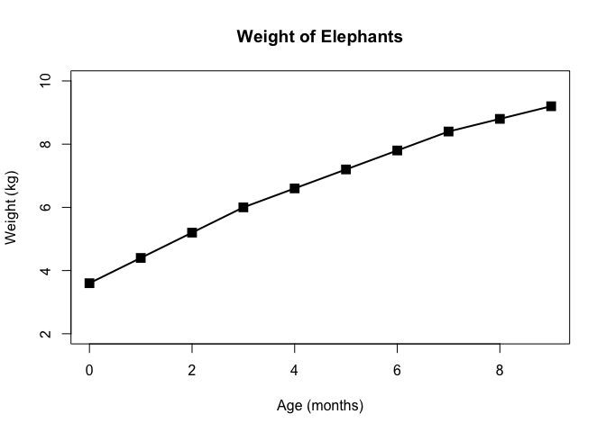
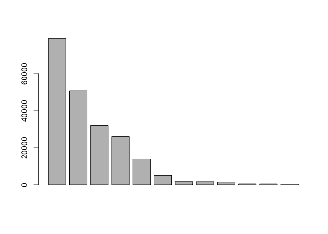
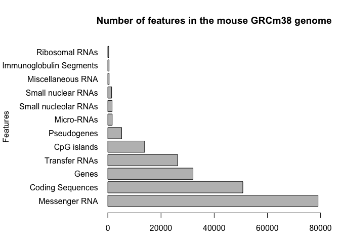
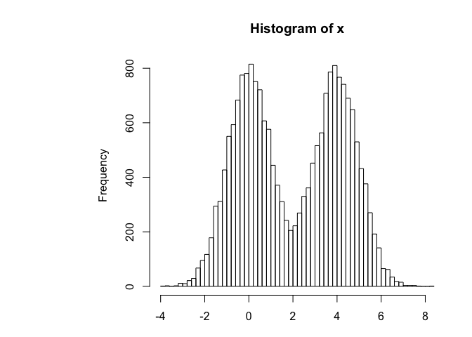
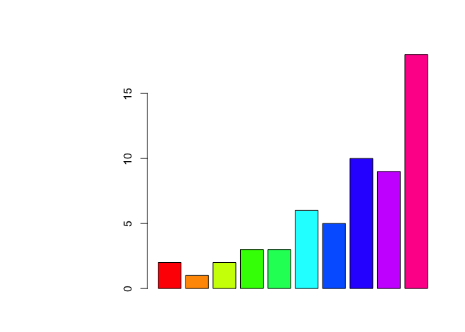
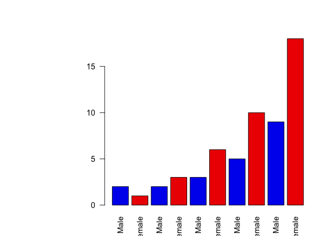
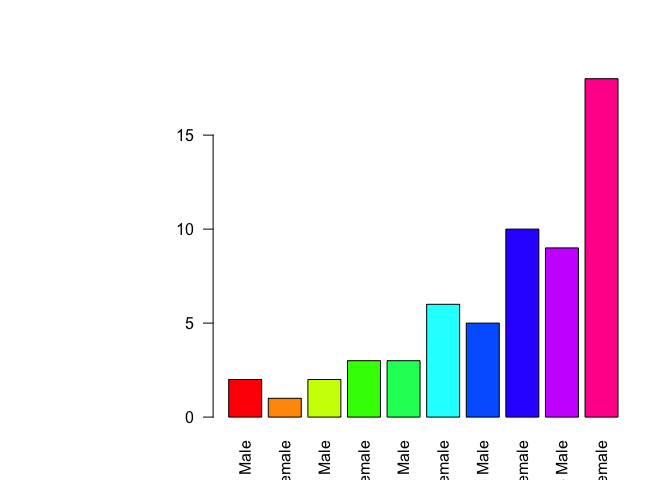
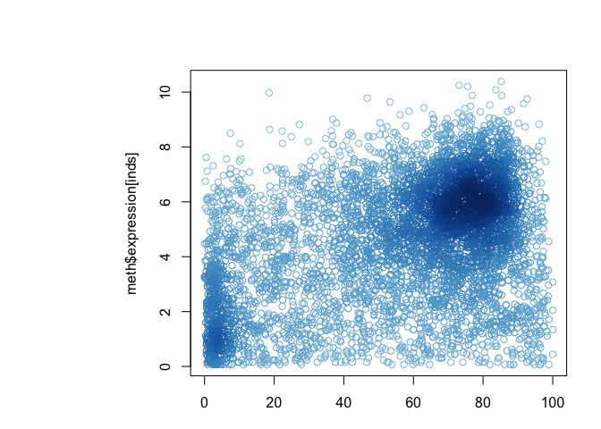
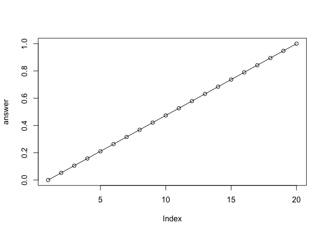
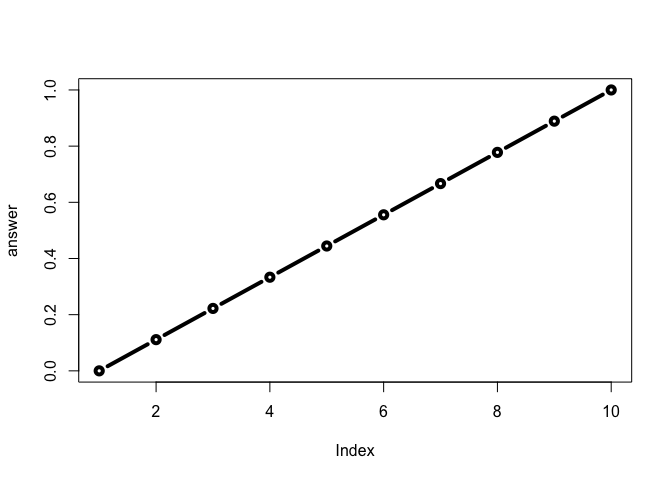

class5rmd
================
Neha Patel
November 1, 2018

``` r
# Baby weight data input 
weight <- read.table("bimm143_05_rstats/weight_chart.txt" , header = TRUE)

# Make a custom plot 
plot(weight , pch=15 , cex=1.5 , lwd=2 , ylim=c(2,10) , xlab="Age (months)" , ylab="Weight (kg)" , main= "Weight of Elephants" , type="o")
```



``` r
# Section 2
# 2B barplot
counts <- read.table("bimm143_05_rstats/feature_counts.txt", sep = "\t", header=TRUE)
barplot(counts$Count)
```



``` r
# bar plot with correct labels 
par(mar=c(3.1, 11.1, 4.1, 2) , mgp=c(10, 1, 0))
barplot(counts$Count , names.arg = counts$Feature , horiz = TRUE , ylab = "Features" , main = "Number of features in the mouse GRCm38 genome" , las=1 , xlim = c(0,80000))
```



``` r
# histogram plot 

par(mgp=c(3, 1, 0))
x <- c(rnorm(10000) , rnorm(10000) + 4)
hist(x, breaks = 80)
```



``` r
# Section 3
#Color Vectors
male_female <- read.table("bimm143_05_rstats/male_female_counts.txt", header = TRUE , sep = "\t")
barplot(male_female$Count, col = c(rainbow(10)))
```



``` r
#Only 2 colors
barplot(male_female$Count, names.arg = male_female$Sample, las=2, col=c("blue2", "red2"))
```



``` r
#Using NROW
barplot(male_female$Count, names.arg = male_female$Sample, las=2, col=rainbow(nrow(male_female)))
```



``` r
 genes <- read.table("bimm143_05_rstats/up_down_expression.txt", header = T, sep = "\t")       
nrow(genes)
```

    ## [1] 5196

``` r
# Dynamic use of color
meth <- read.table("bimm143_05_rstats/expression_methylation.txt", header = TRUE, sep = "\t")
nrow(meth)
```

    ## [1] 9241

``` r
# focus on the data we want to examine
inds <- meth$expression > 0 
mycols2 <- densCols(meth$gene.meth[inds], meth$expression[inds])

plot(meth$gene.meth[inds], meth$expression[inds], col= mycols2)
```



``` r
map.colors3 <- function (x, low.high = range(x), palette= cm.colors(100)) {
  ## Description: map the values of the input vector 'x'
  ## to the input colors vector 'palette'
  
  # Determine percent values of the 'high.low' range
  percent <- ((x-low.high[1])/(low.high[2]-low.high[1]))
  # Find corresponding index position in the color 'palette'
  # note , catch for - percent values to 1 
  index <- round (length(palette-1)*percent) + 1
  return (palette[index])
}

# New Function
add <- function(x, y=1) {
  x + y
}

# NEW FUNCTION 
# changing na.rm to TRUE allows you to neglect the NA and use the function normally
rescale <- function(x, na.rm = TRUE) {
    rng <- range(x, na.rm = na.rm)
    answer <- (x - rng[1]) / (rng[2] - rng[1])
    plot(answer, type = "o")
}
rescale(1:20)
```



``` r
# lecture function
rescale <- function(x, na.rm=TRUE, plot=FALSE) {
  if(na.rm) {
    rng <-range(x, na.rm=TRUE)
  } else {
    rng <-range(x)
  }
  print("Hello")
  answer <- (x - rng[1]) / (rng[2] - rng[1])
  print("is it me you are looking for?")
  if(plot) {
    plot(answer, typ="b", lwd=4)
  }
  print("I can see it in ...")
  return(answer)
}
rescale(1:10, plot = TRUE)
```

    ## [1] "Hello"
    ## [1] "is it me you are looking for?"



    ## [1] "I can see it in ..."

    ##  [1] 0.0000000 0.1111111 0.2222222 0.3333333 0.4444444 0.5555556 0.6666667
    ##  [8] 0.7777778 0.8888889 1.0000000
