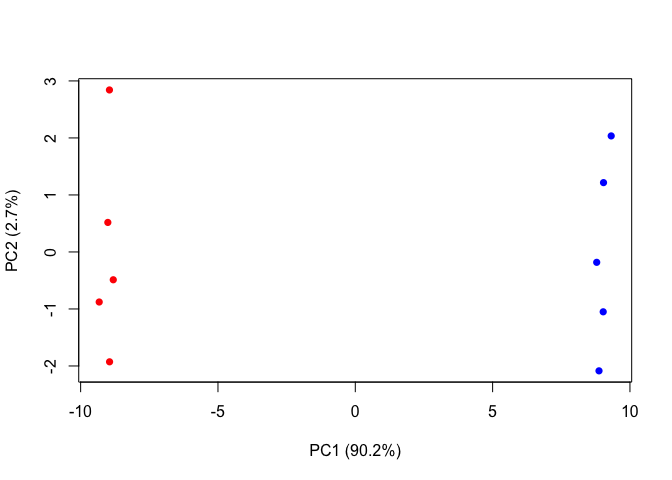

Class 8
================
Neha Patel
October 25, 2018

K-means clustering
------------------

Our first example with **kmeans()** function.

``` r
# Example plot to see how Rmarkdown works
plot(1:10, typ="l")
```


Back to kmeans...

``` r
# Generate some example data for clustering 
tmp <- c(rnorm(30, -3), rnorm(30, 3))
x <- cbind(x=tmp, y=rev(tmp))


k <- kmeans(x, centers = 2, nstart = 20)
palette(c("blue", "green"))
plot(x, col = k$cluster)
points(k$centers, col="black", pch=20, cex=3)
```


``` r
# Generate some example data for clustering 
tmp <- c(rnorm(30, -3), rnorm(30, 3))
x <- cbind(x=tmp, y=rev(tmp))


k3 <- kmeans(x, centers = 3, nstart = 20)
palette(c("blue", "green"))
plot(x, col = k3$cluster)
points(k3$centers, col="black", pch=20, cex=3)
```


``` r
k3$tot.withinss
```

    ## [1] 102.5256

``` r
k$tot.withinss
```

    ## [1] 138.725

Inspect/print the results
=========================

Q. How many points are in each cluster?
=======================================

      30

Q. What ‘component’ of your result object details
=================================================

- cluster size? 30
==================

- cluster assignment/membership? "clustering vector"
====================================================

- cluster center? (-3.015920, 2.671446)
=======================================

Plot x colored by the kmeans cluster assignment and
===================================================

add cluster centers as blue points
==================================

Q. Repeat for k=3, which has the lower tot.withinss?
====================================================

Hierarchical clustering in R
============================

Let's try out the **hclust()** function for Hierarchical clustering in R. This function needs a distance matrix as input!

``` r
d <- dist(x)
hc<- hclust(d)
plot(hc)
# Draw a line on the dendrogram
abline(h=8, col = "red")
```


``` r
# cut the tree to yield cluster membership vector
cutree(hc, h=8) 
```

    ##  [1] 1 1 1 1 1 1 1 1 1 1 1 1 1 1 1 1 1 1 1 1 1 1 1 1 1 1 1 1 1 1 2 2 2 2 2
    ## [36] 2 2 2 2 2 2 2 2 2 2 2 2 2 2 2 2 2 2 2 2 2 2 2 2 2

### A more 'real' example of data clustering

``` r
# Step 1. Generate some example data for clustering
x <- rbind(
  matrix(rnorm(100, mean=0, sd = 0.3), ncol = 2),   # c1
  matrix(rnorm(100, mean = 1, sd = 0.3), ncol = 2), # c2
  matrix(c(rnorm(50, mean = 1, sd = 0.3),           # c3
           rnorm(50, mean = 0, sd = 0.3)), ncol = 2))
colnames(x) <- c("x", "y")
# Step 2. Plot the data without clustering
plot(x)
```


``` r
# Step 3. Generate colors for known clusters
#         (just so we can compare to hclust results)
col <- as.factor( rep(c("c1","c2","c3"), each=50) )
palette(c("blue", "green", "red"))
plot(x, col=col, pch=20)
```


``` r
# Q. Use the dist(), hclust(), plot() and cutree()

#      functions to return 2 and 3 clusters
d2 <- dist(x)
hc2 <- hclust(d2)
plot(hc2)
```


``` r
# Use cutree() functions to return 2 and 3 clusters
cluster3 <- cutree(hc2, k=3)
cluster2 <- cutree(hc2, k=2)
table(cluster3)
```

    ## cluster3
    ##  1  2  3 
    ## 48 53 49

``` r
table(cluster2)
```

    ## cluster2
    ##   1   2 
    ## 101  49

``` r
# Q. How does this compare to your known 'col' groups?
table(col)
```

    ## col
    ## c1 c2 c3 
    ## 50 50 50

``` r
table(cluster3, col)
```

    ##         col
    ## cluster3 c1 c2 c3
    ##        1 45  0  3
    ##        2  5  2 46
    ##        3  0 48  1

Principal component analysis
============================

``` r
## Initialize a blank 100 row by 10 column matrix
mydata <- matrix(nrow=100, ncol=10)
## Lets label the rows gene1, gene2 etc. to gene100
rownames(mydata) <- paste("gene", 1:100, sep="")
## Lets label the first 5 columns wt1, wt2, wt3, wt4 and wt5
##   and the last 5 ko1, ko2 etc. to ko5 (for "knock-out")
colnames(mydata) <- c( paste("wt", 1:5, sep=""),
                       paste("ko", 1:5, sep="") )
## Fill in some fake read counts
for(i in 1:nrow(mydata)) {
wt.values <- rpois(5, lambda=sample(x=10:1000, size=1)) 
ko.values <- rpois(5, lambda=sample(x=10:1000, size=1))
mydata[i,] <- c(wt.values, ko.values)
}
head(mydata)
```

    ##       wt1  wt2 wt3 wt4 wt5 ko1 ko2 ko3 ko4 ko5
    ## gene1 646  662 623 634 590 690 698 692 711 761
    ## gene2 514  557 582 545 587 573 588 576 581 527
    ## gene3 982 1024 919 973 952  65  78  65  61  87
    ## gene4 861  854 883 900 892 258 269 267 242 251
    ## gene5 561  505 503 515 485 238 290 297 242 323
    ## gene6 686  688 738 656 668  56  52  45  53  50

``` r
head(t(mydata))
```

    ##     gene1 gene2 gene3 gene4 gene5 gene6 gene7 gene8 gene9 gene10 gene11
    ## wt1   646   514   982   861   561   686   960   807   856    368    202
    ## wt2   662   557  1024   854   505   688   946   782   823    344    178
    ## wt3   623   582   919   883   503   738   989   761   859    351    189
    ## wt4   634   545   973   900   515   656   956   797   847    316    183
    ## wt5   590   587   952   892   485   668  1012   789   881    328    172
    ## ko1   690   573    65   258   238    56   377   510   163    376    540
    ##     gene12 gene13 gene14 gene15 gene16 gene17 gene18 gene19 gene20 gene21
    ## wt1    203    243    889    733    273    245    322    291    283    409
    ## wt2    189    249    917    793    258    263    313    290    227    426
    ## wt3    203    238    870    789    270    251    348    283    235    397
    ## wt4    205    262    928    751    265    293    294    320    274    438
    ## wt5    224    259    877    745    260    277    335    300    241    434
    ## ko1    923    201     35    232    272    695    858    194    171    494
    ##     gene22 gene23 gene24 gene25 gene26 gene27 gene28 gene29 gene30 gene31
    ## wt1    364     80     48     87    793    916    719    571    286    514
    ## wt2    368     82     35     63    810    908    749    604    296    525
    ## wt3    320     74     46     73    800    935    735    558    287    520
    ## wt4    334    101     44     84    835    969    744    546    301    556
    ## wt5    317     83     53     67    809    914    757    549    296    513
    ## ko1    273    660     98    197    783    326    398    922    801    111
    ##     gene32 gene33 gene34 gene35 gene36 gene37 gene38 gene39 gene40 gene41
    ## wt1    421    547    707    609    626    942    325     42    642    283
    ## wt2    436    466    798    588    615    985    309     27    601    285
    ## wt3    421    460    753    633    614    927    310     50    603    298
    ## wt4    401    473    718    633    575    982    304     40    626    293
    ## wt5    398    466    704    600    612    886    302     50    647    280
    ## ko1    941    972    315    218    470    423    115    794    376    221
    ##     gene42 gene43 gene44 gene45 gene46 gene47 gene48 gene49 gene50 gene51
    ## wt1    320     62    719    374    310    599    551    604    421    417
    ## wt2    261     61    750    363    348    634    536    715    453    404
    ## wt3    352     61    741    391    314    627    576    738    473    416
    ## wt4    291     59    794    409    314    593    603    748    455    449
    ## wt5    298     57    751    394    322    610    498    698    421    445
    ## ko1    278    765    694    311    649    837    966    392    833    536
    ##     gene52 gene53 gene54 gene55 gene56 gene57 gene58 gene59 gene60 gene61
    ## wt1    312    190    329    298    375    292    356    733    814     81
    ## wt2    323    204    326    278    386    302    378    749    821    114
    ## wt3    309    214    301    260    363    297    369    765    878     96
    ## wt4    326    201    318    301    360    348    356    734    845     83
    ## wt5    353    218    345    262    392    340    332    734    878     74
    ## ko1    543    600     67    453    468     50    999    687     36    910
    ##     gene62 gene63 gene64 gene65 gene66 gene67 gene68 gene69 gene70 gene71
    ## wt1    456    796     18    980    194    253    904    906    198     47
    ## wt2    450    809     19    985    189    240    939    915    190     33
    ## wt3    429    831     12    970    181    225    971    891    204     33
    ## wt4    452    825     11    945    205    267    934    971    229     32
    ## wt5    436    870     27    973    192    245    954    890    160     33
    ## ko1    546    899    370    865      5    682    677    264    781    808
    ##     gene72 gene73 gene74 gene75 gene76 gene77 gene78 gene79 gene80 gene81
    ## wt1    418    513    698    525    435     95    821    869    744    469
    ## wt2    421    556    674    475    389     96    807    807    737    503
    ## wt3    443    523    652    488    405    104    787    836    749    465
    ## wt4    457    515    637    531    395    100    815    828    708    500
    ## wt5    418    548    608    495    373     95    841    805    715    470
    ## ko1    916    174    309    495    653    598    105    191    537    513
    ##     gene82 gene83 gene84 gene85 gene86 gene87 gene88 gene89 gene90 gene91
    ## wt1    842    838    265    134    149    580    394    548    270    257
    ## wt2    874    749    229    128    155    560    407    605    298    237
    ## wt3    820    783    251    118    165    548    361    574    282    264
    ## wt4    833    784    254    134    133    532    375    591    296    247
    ## wt5    807    729    246    151    150    486    401    598    306    294
    ## ko1    203    597    466    814    651    347     39    522     62     66
    ##     gene92 gene93 gene94 gene95 gene96 gene97 gene98 gene99 gene100
    ## wt1    217    468    529     60     11     58    700    209     786
    ## wt2    219    460    485     69     17     63    722    218     759
    ## wt3    228    519    511     51     14     84    690    194     781
    ## wt4    227    482    544     67     11     64    741    198     807
    ## wt5    219    480    475     66      6     67    706    213     754
    ## ko1    307    296      9    892     92    492    601    890     418

Now lets try to find "structure" in this data with **promt()**

``` r
pca <- prcomp(t(mydata), scale = TRUE)
pca
```

    ## Standard deviations:
    ##  [1] 9.497942e+00 1.638845e+00 1.367658e+00 1.271902e+00 1.042542e+00
    ##  [6] 9.519203e-01 8.309403e-01 7.564319e-01 5.994693e-01 3.391277e-15
    ## 
    ## Rotation:
    ##                 PC1           PC2           PC3           PC4
    ## gene1    0.08935051  0.2169194163 -0.0962207138  0.2041981894
    ## gene2    0.02465983 -0.3943950095  0.3588732503 -0.3852023256
    ## gene3   -0.10506364  0.0096637227 -0.0053054718  0.0391239894
    ## gene4   -0.10522057 -0.0118439498 -0.0112568564 -0.0126307131
    ## gene5   -0.10207040  0.0810229276 -0.1054801108  0.0121379923
    ## gene6   -0.10502544  0.0168108495 -0.0005712636 -0.0263871146
    ## gene7   -0.10501125 -0.0082780457 -0.0287801525 -0.0328553905
    ## gene8   -0.10406658 -0.0123421821 -0.0722022834  0.0425442880
    ## gene9   -0.10515758 -0.0004017924 -0.0156111651 -0.0223543150
    ## gene10   0.09016028  0.2303281452 -0.1150922706 -0.0726355148
    ## gene11   0.10505321  0.0119570023  0.0016364887 -0.0126972000
    ## gene12   0.10485544 -0.0199438451 -0.0199994848 -0.0245646960
    ## gene13  -0.08846504 -0.1311523783  0.2792132012 -0.0052393821
    ## gene14  -0.10520917  0.0015999773 -0.0045085162  0.0262859109
    ## gene15  -0.10489538  0.0097100773 -0.0012048081  0.0019048638
    ## gene16   0.02694329  0.4374700664  0.2801450482 -0.0782895898
    ## gene17   0.10489529 -0.0154359655  0.0144328711  0.0023135627
    ## gene18   0.10478678 -0.0126977667 -0.0525570086 -0.0335455226
    ## gene19  -0.10226306 -0.0062484722 -0.0587599814  0.0953932931
    ## gene20  -0.09524960  0.1490109843 -0.0485834163  0.0766598366
    ## gene21   0.09760074 -0.1543752729 -0.0112303731  0.0925498521
    ## gene22  -0.09548996  0.1103483985 -0.0051773588  0.2110185907
    ## gene23   0.10510678  0.0064722108  0.0228729069  0.0103416313
    ## gene24   0.09636453 -0.0995736157 -0.1123745603 -0.1213077672
    ## gene25   0.10173671 -0.0083898843 -0.0216744619  0.0471057798
    ## gene26  -0.07207956 -0.1198441234 -0.4301768924  0.1240964501
    ## gene27  -0.10512867 -0.0092358704 -0.0053226802 -0.0055693098
    ## gene28  -0.10490764 -0.0226188955 -0.0329152616  0.0010020382
    ## gene29   0.10486670  0.0156996030 -0.0133582469  0.0395877988
    ## gene30   0.10514558 -0.0198305645  0.0196840959  0.0054121632
    ## gene31  -0.10505008  0.0059049767 -0.0256894878  0.0226352086
    ## gene32   0.10520832  0.0042284733  0.0155818450  0.0048538248
    ## gene33   0.10408659  0.0297199028 -0.0502180149 -0.0077647248
    ## gene34  -0.10444058 -0.0068893585  0.0301157252  0.0276546985
    ## gene35  -0.10494556  0.0126228614 -0.0275166610 -0.0119437127
    ## gene36  -0.10033144 -0.0148246985 -0.0403471326 -0.0106150017
    ## gene37  -0.10457887  0.0319941845  0.0095960156  0.0613574154
    ## gene38  -0.10499876  0.0115998012 -0.0120907492 -0.0006135729
    ## gene39   0.10521125  0.0023973327  0.0112992480 -0.0131817988
    ## gene40  -0.10462673 -0.0078589648  0.0068536731 -0.0089381108
    ## gene41  -0.08923024 -0.0746342261  0.2090046476 -0.1415049126
    ## gene42  -0.02963203  0.2533797679 -0.2564339530 -0.5985962927
    ## gene43   0.10521363  0.0039585435  0.0004942715  0.0039325493
    ## gene44  -0.08742438 -0.2355725516  0.1516069005  0.0660102750
    ## gene45  -0.08097839 -0.0921561276 -0.1747431862 -0.1829031575
    ## gene46   0.10453838 -0.0186280601  0.0696199511  0.0009201650
    ## gene47   0.10355806 -0.0344764150 -0.0532500721  0.0190699109
    ## gene48   0.10402685  0.0247600544 -0.0173928632 -0.0064511050
    ## gene49  -0.10230088 -0.0749637150  0.0302053104 -0.0251999411
    ## gene50   0.10447222  0.0134246401  0.0664396448 -0.0082739282
    ## gene51   0.09191971 -0.0576675301 -0.3021505817  0.0080063738
    ## gene52   0.10425727 -0.0437331214  0.0253950522 -0.0207426768
    ## gene53   0.10478958  0.0178992699 -0.0177448274 -0.0057265763
    ## gene54  -0.10488187 -0.0083769327  0.0014024676  0.0232891134
    ## gene55   0.10308315  0.0097945420 -0.0679485290  0.0748111941
    ## gene56   0.09642853  0.0592070559 -0.1097630242  0.0285688798
    ## gene57  -0.10454794 -0.0440791968 -0.0015256578  0.0140102307
    ## gene58   0.10487923 -0.0240428699 -0.0185684060  0.0127870920
    ## gene59  -0.09202989 -0.1152415627 -0.1466581796  0.0010448320
    ## gene60  -0.10515843 -0.0063668226 -0.0043177290 -0.0258374742
    ## gene61   0.10509703 -0.0079323014  0.0066624071 -0.0073269097
    ## gene62   0.10349785  0.0295835494  0.0113815656  0.0688088724
    ## gene63   0.04596836 -0.4012105882 -0.2966655859 -0.1422626772
    ## gene64   0.10521917  0.0009150884  0.0089441619  0.0054771954
    ## gene65  -0.10161818  0.0746428511  0.0903574792 -0.0125515414
    ## gene66  -0.10506387  0.0027587314  0.0049143311  0.0183769739
    ## gene67   0.10484262 -0.0019826045 -0.0289041043  0.0316774409
    ## gene68  -0.10138107  0.0364370648 -0.0391156958 -0.0679882233
    ## gene69  -0.10494445  0.0120782877 -0.0011780069  0.0411914612
    ## gene70   0.10493535  0.0025825931  0.0114026824 -0.0005033648
    ## gene71   0.10523629  0.0076598893  0.0087636941 -0.0046621463
    ## gene72   0.10449764  0.0265545943  0.0310856205  0.0116709874
    ## gene73  -0.10489793 -0.0075140904  0.0207725203  0.0103264590
    ## gene74  -0.10399427  0.0543860089 -0.0154559188  0.0208033943
    ## gene75  -0.08139682 -0.0242903050 -0.0101605588  0.1355982298
    ## gene76   0.10407023  0.0648579232 -0.0034697210 -0.0118880958
    ## gene77   0.10511064  0.0086581689  0.0267326697 -0.0130233139
    ## gene78  -0.10517147  0.0009222964  0.0132376822  0.0025113765
    ## gene79  -0.10509698  0.0333171636 -0.0133291866 -0.0023139302
    ## gene80  -0.10100949  0.1321257188  0.0230871252 -0.0008517563
    ## gene81   0.08151300 -0.1344789402  0.0935874716  0.4041438881
    ## gene82  -0.10508863  0.0112453037 -0.0012361044  0.0340943285
    ## gene83  -0.09845909  0.1236882956 -0.0448270713 -0.0391963472
    ## gene84   0.10469045  0.0178070357 -0.0296374840 -0.0289133087
    ## gene85   0.10504019 -0.0076090450  0.0412328528 -0.0030471917
    ## gene86   0.10511362  0.0077699661  0.0364548510 -0.0179749032
    ## gene87  -0.10165112  0.0582207559  0.0527207815  0.0327061796
    ## gene88  -0.10493186  0.0029740346 -0.0063651711  0.0323276066
    ## gene89  -0.09526414 -0.1744443935 -0.1372084744  0.0968084182
    ## gene90  -0.10488755 -0.0228260518  0.0171845903  0.0104922436
    ## gene91  -0.10396080  0.0005515388  0.0240846065 -0.0662164585
    ## gene92   0.10270851 -0.0463307602  0.0051872467 -0.0136086998
    ## gene93  -0.10313836  0.0133665012  0.0251726416 -0.1066142775
    ## gene94  -0.10505502  0.0199809019 -0.0133117506  0.0102791671
    ## gene95   0.10526173 -0.0046980030  0.0012643813  0.0090463288
    ## gene96   0.10433024 -0.0115874745  0.0717163427 -0.0062928717
    ## gene97   0.10473273 -0.0077642673  0.0077058423 -0.0044680105
    ## gene98  -0.10166908 -0.0783351149  0.0708833446  0.0956337963
    ## gene99   0.10513152  0.0125335932 -0.0092447381  0.0009487262
    ## gene100 -0.10500830  0.0211028843 -0.0075845839  0.0019253366
    ##                   PC5           PC6           PC7          PC8
    ## gene1    0.1344056989 -0.1040506850  0.1599899763  0.088839316
    ## gene2   -0.0775923281 -0.1385419071  0.1577847166 -0.019695723
    ## gene3    0.0124318039 -0.0235057351  0.0241266710 -0.020918727
    ## gene4    0.0004263567  0.0156625930  0.0091596760  0.011815713
    ## gene5    0.1317627664  0.0019444431 -0.0409004640 -0.036699434
    ## gene6   -0.0180422902 -0.0407951600  0.0087207926 -0.016025692
    ## gene7   -0.0188482732 -0.0114951246  0.0304085397 -0.008137665
    ## gene8    0.0234118257 -0.0228427008 -0.0973999706  0.018370610
    ## gene9    0.0035956421 -0.0128063383 -0.0058771858  0.017408618
    ## gene10   0.0972154428 -0.2409237430 -0.1214391740 -0.175486987
    ## gene11   0.0185145486  0.0413072719 -0.0118875937 -0.052771247
    ## gene12   0.0386285814  0.0429098659  0.0155909861 -0.057072917
    ## gene13   0.1933166300  0.2142936178  0.0125993022 -0.036545716
    ## gene14   0.0117410599 -0.0048087385  0.0094804466  0.009055105
    ## gene15  -0.0165730833 -0.0355010711  0.0731986950 -0.015709561
    ## gene16  -0.3620395627  0.2838035649  0.2129988431  0.168131283
    ## gene17   0.0520108896  0.0302191272  0.0089698144  0.064451467
    ## gene18  -0.0086032379 -0.0019294088  0.0124751478 -0.054785294
    ## gene19  -0.0973026159  0.0534778536 -0.0023527558  0.196327507
    ## gene20   0.0341852407  0.2305532775 -0.2056305442  0.162624729
    ## gene21   0.1364099314 -0.0098482465 -0.1654307461  0.156648294
    ## gene22   0.0930396262 -0.0631731206  0.0131232950 -0.322099302
    ## gene23  -0.0116920370  0.0396775305  0.0217242435  0.020237528
    ## gene24   0.2337235768  0.0385385766 -0.1443112535 -0.125499546
    ## gene25  -0.1529542484  0.0851496262 -0.2014652643  0.004376343
    ## gene26   0.0361749435  0.2143293212  0.2935056604 -0.087143817
    ## gene27   0.0326160465  0.0227759949 -0.0196256233  0.027363925
    ## gene28   0.0287874557 -0.0270531263  0.0522419489  0.013092413
    ## gene29   0.0143030339 -0.0662894027  0.0025328535  0.005437050
    ## gene30   0.0001775463  0.0152462141 -0.0288406498  0.007523720
    ## gene31   0.0128767344  0.0154149772  0.0292078155  0.041597311
    ## gene32   0.0057975930 -0.0067702297 -0.0053513328 -0.026690023
    ## gene33   0.0666953698  0.0583176488 -0.0031233530 -0.108493628
    ## gene34  -0.0098202056 -0.0719680299  0.0459655483 -0.055301783
    ## gene35  -0.0097712614  0.0035617672 -0.0238285745  0.073594670
    ## gene36  -0.0394693383 -0.2285327744 -0.2317344931 -0.016467039
    ## gene37   0.0270595272  0.0008797594  0.0393216491  0.021295109
    ## gene38   0.0083125343 -0.0158697371 -0.0525772737 -0.067412309
    ## gene39  -0.0065131324  0.0286133190  0.0116761058 -0.001322140
    ## gene40  -0.0179247926  0.0447182735 -0.0392794015 -0.033371059
    ## gene41   0.1977802668  0.1937619584  0.0042893386 -0.333130361
    ## gene42   0.0244335569  0.1201009338 -0.0865011268  0.038078980
    ## gene43   0.0028476234 -0.0060291366 -0.0192483249  0.041964221
    ## gene44   0.0975899832  0.3007607905 -0.0071349192  0.055723635
    ## gene45   0.4021432524  0.2103707660 -0.0082478744  0.316387077
    ## gene46   0.0576344267 -0.0093193090  0.0078066519 -0.027012728
    ## gene47  -0.0763441335 -0.1168650207 -0.0249804727 -0.001976033
    ## gene48   0.0575825094  0.1039262819  0.0317938371  0.002006645
    ## gene49   0.0411256545  0.0194411122  0.1348811759  0.110788843
    ## gene50  -0.0093084825  0.0142109258  0.0248823685  0.057714550
    ## gene51  -0.0439691843  0.1953093755  0.1612722770  0.041432816
    ## gene52   0.0782433724  0.0073406441  0.0008267683  0.034815683
    ## gene53  -0.0365341832  0.0098142988  0.0875316290  0.043359414
    ## gene54  -0.0348594059 -0.0137939823  0.0129929134 -0.021730802
    ## gene55   0.0251919915  0.1322665567 -0.0284207884 -0.101545501
    ## gene56  -0.0505033861 -0.0039187168  0.3774418645 -0.141447296
    ## gene57   0.0016731511  0.0492889143  0.0215756678  0.086479569
    ## gene58  -0.0166771789  0.0027178030 -0.0374920462 -0.053397415
    ## gene59  -0.1552352864 -0.2271537241 -0.2696639774  0.014081293
    ## gene60  -0.0149188996 -0.0139650427  0.0212715965  0.028101569
    ## gene61   0.0524766796 -0.0014981939 -0.0048672982 -0.011056073
    ## gene62   0.0676325972  0.1046182210  0.0287548287 -0.115277635
    ## gene63  -0.3905572511  0.0419575121  0.0240877468 -0.096276988
    ## gene64  -0.0219989813 -0.0014781348  0.0015054450  0.021073930
    ## gene65  -0.0196498234 -0.1047225483  0.1234283991 -0.151297776
    ## gene66   0.0344958675  0.0421627689  0.0138572337  0.003578197
    ## gene67  -0.0344513048  0.0631106863  0.0154433659 -0.015837559
    ## gene68   0.0632557011 -0.0991330627  0.1667862804  0.214669020
    ## gene69  -0.0078849650  0.0134149897  0.0015338816  0.072254085
    ## gene70   0.0304398521  0.0623304673 -0.0011874504 -0.018896171
    ## gene71   0.0185013003  0.0137393952 -0.0016021783  0.007913251
    ## gene72  -0.0551296287  0.0469157566  0.0408004524  0.079109315
    ## gene73  -0.0023821909 -0.0587544687  0.0600165977 -0.001664055
    ## gene74   0.0769090458 -0.0441619431 -0.0482090562 -0.093591343
    ## gene75  -0.3907686030  0.3614244044 -0.3453107693 -0.081944178
    ## gene76   0.0120977082  0.0739882933  0.0008813330 -0.100703698
    ## gene77   0.0274594061  0.0200794973  0.0135061858  0.018680027
    ## gene78   0.0060726292 -0.0060163251  0.0036456504  0.006556422
    ## gene79  -0.0077971221  0.0037391704 -0.0132895320 -0.010413018
    ## gene80  -0.0537155296 -0.1306866085  0.0510568736  0.139770965
    ## gene81   0.1083626778 -0.0280394694 -0.0390438438  0.216173084
    ## gene82   0.0050513895 -0.0375456914  0.0031108015 -0.011781370
    ## gene83   0.1441807149  0.1427326455 -0.1379339211 -0.198014358
    ## gene84   0.0567134207  0.0418107175 -0.0500554902  0.023930192
    ## gene85  -0.0071336986  0.0317090124 -0.0035894000 -0.007016422
    ## gene86   0.0062422861 -0.0036849516  0.0043186379  0.005156405
    ## gene87  -0.0210647146  0.0443077214 -0.0283079002 -0.261359553
    ## gene88  -0.0020724089 -0.0423439205  0.0267949234 -0.025138867
    ## gene89  -0.0500823694 -0.0596979671  0.2390798827 -0.042164803
    ## gene90   0.0032341301 -0.0134204447  0.0745734868  0.035963220
    ## gene91  -0.0681502547 -0.0093823264  0.0322099434  0.052909031
    ## gene92   0.0458522232 -0.0522638762 -0.1769860029  0.156294903
    ## gene93   0.0028502693 -0.0375796593 -0.0379076461  0.159171318
    ## gene94   0.0062289210  0.0350701600 -0.0366414795  0.017859348
    ## gene95  -0.0021299057  0.0075753207 -0.0080173818  0.016898021
    ## gene96   0.0501736796  0.0116912070 -0.0214189011 -0.066449752
    ## gene97  -0.0177525640 -0.0385886864 -0.0668579976  0.095201306
    ## gene98  -0.0021357609  0.1419768420  0.0222710942 -0.108211721
    ## gene99   0.0272850466  0.0094086181  0.0430035584  0.002104796
    ## gene100  0.0203074272  0.0546282126 -0.0053207094  0.010386159
    ##                   PC9         PC10
    ## gene1   -0.2175932861 -0.490480121
    ## gene2   -0.1189142338 -0.029160338
    ## gene3    0.0181280163  0.008952422
    ## gene4    0.0052157658 -0.141669194
    ## gene5    0.0431630079  0.006021924
    ## gene6   -0.0526328211 -0.030894472
    ## gene7    0.0391118533  0.007705154
    ## gene8    0.0769658734 -0.077522320
    ## gene9    0.0475536926  0.057639325
    ## gene10   0.0245759166 -0.034338613
    ## gene11  -0.0209057748  0.042436406
    ## gene12   0.0114250713 -0.007297581
    ## gene13   0.2289239224 -0.041937642
    ## gene14  -0.0066579688  0.002199403
    ## gene15  -0.0719925399  0.009019634
    ## gene16  -0.0483413248 -0.181301206
    ## gene17   0.0216964442  0.040451677
    ## gene18  -0.0191030174  0.022178741
    ## gene19   0.0322380174  0.051229414
    ## gene20   0.1990606246  0.082106965
    ## gene21   0.1609575553 -0.246550031
    ## gene22  -0.0189599425 -0.046275063
    ## gene23  -0.0019589931  0.046016349
    ## gene24   0.1071219838 -0.087831919
    ## gene25  -0.0665996027 -0.043465125
    ## gene26  -0.2030242007  0.007737353
    ## gene27  -0.0304299922 -0.034417556
    ## gene28   0.0250285420  0.022343656
    ## gene29  -0.0231067440 -0.018629904
    ## gene30  -0.0073346816 -0.061125525
    ## gene31  -0.0309548646  0.060915587
    ## gene32  -0.0345367477  0.044620958
    ## gene33   0.0474185322  0.072703962
    ## gene34  -0.1170839557  0.027437136
    ## gene35  -0.0464261672  0.037418996
    ## gene36   0.0713829070 -0.096549216
    ## gene37  -0.0791492032  0.076094725
    ## gene38   0.0013471316 -0.034024450
    ## gene39   0.0008527838 -0.006584729
    ## gene40   0.1513955143  0.017753539
    ## gene41  -0.1874508400 -0.100413183
    ## gene42  -0.2688679911  0.062822554
    ## gene43  -0.0015281218  0.018210630
    ## gene44  -0.2193827157 -0.101643121
    ## gene45   0.0577792265 -0.085643798
    ## gene46   0.0025837419 -0.019014880
    ## gene47  -0.1097108385 -0.093785119
    ## gene48  -0.1435393407  0.008574167
    ## gene49  -0.2130265608 -0.032852281
    ## gene50  -0.1046551705  0.098362803
    ## gene51   0.0813453894 -0.110598438
    ## gene52   0.1180667609 -0.065694912
    ## gene53  -0.0012271146  0.030003624
    ## gene54   0.1145061144 -0.002752454
    ## gene55  -0.0357308878 -0.045617117
    ## gene56   0.2063886129  0.227596011
    ## gene57   0.0672404974  0.030027824
    ## gene58  -0.0806660289 -0.059065725
    ## gene59  -0.3199391002 -0.007791826
    ## gene60   0.0063599344  0.008820248
    ## gene61  -0.0214621607 -0.021553514
    ## gene62   0.0317331394 -0.069670962
    ## gene63   0.1354044983  0.053964309
    ## gene64   0.0281301169  0.004118182
    ## gene65   0.1054301667 -0.210533677
    ## gene66   0.0394152628  0.007760221
    ## gene67   0.0003919967  0.034804141
    ## gene68  -0.0136239313  0.031770137
    ## gene69  -0.0181341720  0.067500644
    ## gene70  -0.0678576767  0.036900902
    ## gene71   0.0085559156  0.023844425
    ## gene72  -0.0519249249  0.095174510
    ## gene73   0.0409734329 -0.044785655
    ## gene74  -0.0366356841  0.015536413
    ## gene75  -0.0279265158 -0.174397532
    ## gene76  -0.0368728876  0.166848539
    ## gene77  -0.0036060237  0.036672828
    ## gene78   0.0693205898  0.027607419
    ## gene79   0.0021053970  0.010008860
    ## gene80  -0.0175227928  0.212979070
    ## gene81  -0.2896799047  0.329607995
    ## gene82  -0.0190850982  0.047025641
    ## gene83  -0.0649773321  0.223079541
    ## gene84   0.0286854558  0.069695714
    ## gene85   0.0293277335  0.036213538
    ## gene86  -0.0070324583 -0.001340041
    ## gene87  -0.1661599240  0.028813527
    ## gene88   0.0823719599 -0.001098594
    ## gene89  -0.0877458317 -0.220555386
    ## gene90   0.0431705014  0.010911407
    ## gene91   0.1616416252  0.003909965
    ## gene92  -0.0723431559  0.002592849
    ## gene93  -0.0993755837 -0.088189845
    ## gene94  -0.0388135641  0.046180219
    ## gene95   0.0015986997 -0.008861785
    ## gene96  -0.0804204995  0.017134586
    ## gene97  -0.0243001806 -0.026009712
    ## gene98  -0.0654107910  0.138165250
    ## gene99   0.0223609021  0.054643361
    ## gene100 -0.0448931461  0.113030416

Make a PC plot of PC1 vs PC2. For this I use the '*x*′*c**o**m**p**o**n**e**n**t**o**f**o**u**r**o**u**t**p**u**t*(*i*.*e*.*p**c**a*x).

``` r
plot(pca$x[,1], pca$x[,2])
```


``` r
## Precent variance is often more informative to look at
pca.var <- pca$sdev^2
pca.var.per <- round(pca.var/sum(pca.var)*100, 1)

pca.var.per
```

    ##  [1] 90.2  2.7  1.9  1.6  1.1  0.9  0.7  0.6  0.4  0.0

``` r
barplot(pca.var.per, main="Scree Plot",
        xlab="Principal Component", ylab="Percent Variation")
```


``` r
# A vector of colors for wt and ko samples
colvec <- colnames(mydata)
colvec[grep("wt", colvec)] <- "red"
colvec[grep("ko", colvec)] <- "blue"
plot(pca$x[,1], pca$x[,2], col=colvec, pch=16,
     xlab=paste0("PC1 (", pca.var.per[1], "%)"),
     ylab=paste0("PC2 (", pca.var.per[2], "%)"))
```


