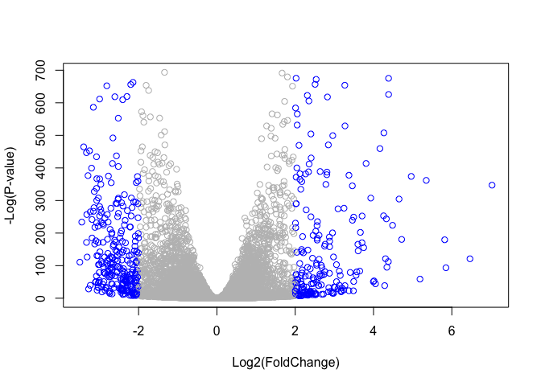

Class 16: Pathway Analysis from RNA-Seq Results
================

``` r
library(DESeq2)
```

    ## Loading required package: S4Vectors

    ## Loading required package: stats4

    ## Loading required package: BiocGenerics

    ## Loading required package: parallel

    ## 
    ## Attaching package: 'BiocGenerics'

    ## The following objects are masked from 'package:parallel':
    ## 
    ##     clusterApply, clusterApplyLB, clusterCall, clusterEvalQ,
    ##     clusterExport, clusterMap, parApply, parCapply, parLapply,
    ##     parLapplyLB, parRapply, parSapply, parSapplyLB

    ## The following objects are masked from 'package:stats':
    ## 
    ##     IQR, mad, xtabs

    ## The following objects are masked from 'package:base':
    ## 
    ##     anyDuplicated, append, as.data.frame, cbind, colnames,
    ##     do.call, duplicated, eval, evalq, Filter, Find, get, grep,
    ##     grepl, intersect, is.unsorted, lapply, lengths, Map, mapply,
    ##     match, mget, order, paste, pmax, pmax.int, pmin, pmin.int,
    ##     Position, rank, rbind, Reduce, rownames, sapply, setdiff,
    ##     sort, table, tapply, union, unique, unsplit, which, which.max,
    ##     which.min

    ## 
    ## Attaching package: 'S4Vectors'

    ## The following objects are masked from 'package:base':
    ## 
    ##     colMeans, colSums, expand.grid, rowMeans, rowSums

    ## Loading required package: IRanges

    ## Loading required package: GenomicRanges

    ## Loading required package: GenomeInfoDb

    ## Loading required package: SummarizedExperiment

    ## Loading required package: Biobase

    ## Welcome to Bioconductor
    ## 
    ##     Vignettes contain introductory material; view with
    ##     'browseVignettes()'. To cite Bioconductor, see
    ##     'citation("Biobase")', and for packages 'citation("pkgname")'.

``` r
metaFile <- ("data/GSE37704_metadata.csv")
countFile <- ("data/GSE37704_featurecounts.csv")

# Import Meta Data
colData <- read.csv(metaFile, row.names=1)
head(colData)
```

    ##               condition
    ## SRR493366 control_sirna
    ## SRR493367 control_sirna
    ## SRR493368 control_sirna
    ## SRR493369      hoxa1_kd
    ## SRR493370      hoxa1_kd
    ## SRR493371      hoxa1_kd

``` r
# Import count data 
countData <- read.csv(countFile, row.names=1)
head(countData)
```

    ##                 length SRR493366 SRR493367 SRR493368 SRR493369 SRR493370
    ## ENSG00000186092    918         0         0         0         0         0
    ## ENSG00000279928    718         0         0         0         0         0
    ## ENSG00000279457   1982        23        28        29        29        28
    ## ENSG00000278566    939         0         0         0         0         0
    ## ENSG00000273547    939         0         0         0         0         0
    ## ENSG00000187634   3214       124       123       205       207       212
    ##                 SRR493371
    ## ENSG00000186092         0
    ## ENSG00000279928         0
    ## ENSG00000279457        46
    ## ENSG00000278566         0
    ## ENSG00000273547         0
    ## ENSG00000187634       258

``` r
# Need to remove the odd first $length col
# Need count data and col data to match so you need to remove the odd first column 
# -1 neglects the first column 
countData <- as.matrix(countData[,-1])
head(countData)
```

    ##                 SRR493366 SRR493367 SRR493368 SRR493369 SRR493370
    ## ENSG00000186092         0         0         0         0         0
    ## ENSG00000279928         0         0         0         0         0
    ## ENSG00000279457        23        28        29        29        28
    ## ENSG00000278566         0         0         0         0         0
    ## ENSG00000273547         0         0         0         0         0
    ## ENSG00000187634       124       123       205       207       212
    ##                 SRR493371
    ## ENSG00000186092         0
    ## ENSG00000279928         0
    ## ENSG00000279457        46
    ## ENSG00000278566         0
    ## ENSG00000273547         0
    ## ENSG00000187634       258

``` r
# Filter count data so you neglect the 0s of the data set
sum <- rowSums(countData)
nonzero <- sum!=0
countData = countData[nonzero, ]
head(countData)
```

    ##                 SRR493366 SRR493367 SRR493368 SRR493369 SRR493370
    ## ENSG00000279457        23        28        29        29        28
    ## ENSG00000187634       124       123       205       207       212
    ## ENSG00000188976      1637      1831      2383      1226      1326
    ## ENSG00000187961       120       153       180       236       255
    ## ENSG00000187583        24        48        65        44        48
    ## ENSG00000187642         4         9        16        14        16
    ##                 SRR493371
    ## ENSG00000279457        46
    ## ENSG00000187634       258
    ## ENSG00000188976      1504
    ## ENSG00000187961       357
    ## ENSG00000187583        64
    ## ENSG00000187642        16

``` r
nrow(countData)
```

    ## [1] 15975

running DESeq2
==============

``` r
dds = DESeqDataSetFromMatrix(countData=countData,
                             colData=colData,
                             design=~condition)
dds = DESeq(dds)
```

    ## estimating size factors

    ## estimating dispersions

    ## gene-wise dispersion estimates

    ## mean-dispersion relationship

    ## final dispersion estimates

    ## fitting model and testing

``` r
results(dds)
```

    ## log2 fold change (MAP): condition hoxa1_kd vs control_sirna 
    ## Wald test p-value: condition hoxa1_kd vs control_sirna 
    ## DataFrame with 15975 rows and 6 columns
    ##                   baseMean log2FoldChange      lfcSE        stat
    ##                  <numeric>      <numeric>  <numeric>   <numeric>
    ## ENSG00000279457   29.91358      0.1657155 0.29999393   0.5523961
    ## ENSG00000187634  183.22965      0.4200459 0.13805437   3.0426121
    ## ENSG00000188976 1651.18808     -0.6911058 0.05471529 -12.6309448
    ## ENSG00000187961  209.63794      0.7200569 0.12999252   5.5392180
    ## ENSG00000187583   47.25512      0.0383645 0.25695539   0.1493041
    ## ...                    ...            ...        ...         ...
    ## ENSG00000273748  35.302652      0.6293124  0.2828453   2.2249350
    ## ENSG00000278817   2.423024     -0.1960528  0.5673385  -0.3455659
    ## ENSG00000278384   1.101796      0.1070916  0.5294202   0.2022808
    ## ENSG00000276345  73.644956     -0.3446374  0.2008392  -1.7159866
    ## ENSG00000271254 181.595903     -0.6003417  0.1390615  -4.3170933
    ##                       pvalue         padj
    ##                    <numeric>    <numeric>
    ## ENSG00000279457 5.806770e-01 6.789940e-01
    ## ENSG00000187634 2.345345e-03 4.997236e-03
    ## ENSG00000188976 1.425563e-36 1.696914e-35
    ## ENSG00000187961 3.038253e-08 1.075918e-07
    ## ENSG00000187583 8.813136e-01 9.166399e-01
    ## ...                      ...          ...
    ## ENSG00000273748 2.608560e-02 4.633550e-02
    ## ENSG00000278817 7.296690e-01 8.040124e-01
    ## ENSG00000278384 8.396972e-01 8.891238e-01
    ## ENSG00000276345 8.616450e-02 1.362446e-01
    ## ENSG00000271254 1.580974e-05 4.368647e-05

``` r
res = results(dds, contrast=c("condition", "hoxa1_kd", "control_sirna"))
```

``` r
summary(res)
```

    ## 
    ## out of 15975 with nonzero total read count
    ## adjusted p-value < 0.1
    ## LFC > 0 (up)     : 4367, 27% 
    ## LFC < 0 (down)   : 4417, 28% 
    ## outliers [1]     : 0, 0% 
    ## low counts [2]   : 1548, 9.7% 
    ## (mean count < 1)
    ## [1] see 'cooksCutoff' argument of ?results
    ## [2] see 'independentFiltering' argument of ?results

``` r
mycols <- rep("gray", nrow(res) )

# Color red the genes with absolute fold change above 2
mycols[ abs(res$log2FoldChange) > 2 ] <- "red"

# Color blue those with adjusted p-value less than 0.01
#  and absolute fold change more than 2
inds <- (res$padj < 0.01) & (abs(res$log2FoldChange) > 2 )
mycols[ inds ] <- "blue"

plot(res$log2FoldChange, -log(res$padj), col=mycols, xlab="Log2(FoldChange)", ylab="-Log(P-value)")
```



``` r
library("AnnotationDbi")
library("org.Hs.eg.db")
```

    ## 

``` r
columns(org.Hs.eg.db)
```

    ##  [1] "ACCNUM"       "ALIAS"        "ENSEMBL"      "ENSEMBLPROT" 
    ##  [5] "ENSEMBLTRANS" "ENTREZID"     "ENZYME"       "EVIDENCE"    
    ##  [9] "EVIDENCEALL"  "GENENAME"     "GO"           "GOALL"       
    ## [13] "IPI"          "MAP"          "OMIM"         "ONTOLOGY"    
    ## [17] "ONTOLOGYALL"  "PATH"         "PFAM"         "PMID"        
    ## [21] "PROSITE"      "REFSEQ"       "SYMBOL"       "UCSCKG"      
    ## [25] "UNIGENE"      "UNIPROT"

``` r
res$symbol = mapIds(org.Hs.eg.db,
                    keys=row.names(res), 
                    keytype="ENSEMBL",
                    column="SYMBOL",
                    multiVals="first")
```

    ## 'select()' returned 1:many mapping between keys and columns

``` r
res$entrez = mapIds(org.Hs.eg.db,
                    keys=row.names(res),
                    keytype="ENSEMBL",
                    column="ENTREZID",
                    multiVals="first")
```

    ## 'select()' returned 1:many mapping between keys and columns

``` r
res$name =   mapIds(org.Hs.eg.db,
                    keys=row.names(res),
                    keytype="ENSEMBL",
                    column="GENENAME",
                    multiVals="first")
```

    ## 'select()' returned 1:many mapping between keys and columns

``` r
head(res, 10)
```

    ## log2 fold change (MAP): condition hoxa1_kd vs control_sirna 
    ## Wald test p-value: condition hoxa1_kd vs control_sirna 
    ## DataFrame with 10 rows and 9 columns
    ##                     baseMean log2FoldChange      lfcSE        stat
    ##                    <numeric>      <numeric>  <numeric>   <numeric>
    ## ENSG00000279457   29.9135794     0.16571546 0.29999393   0.5523961
    ## ENSG00000187634  183.2296499     0.42004588 0.13805437   3.0426121
    ## ENSG00000188976 1651.1880762    -0.69110576 0.05471529 -12.6309448
    ## ENSG00000187961  209.6379385     0.72005692 0.12999252   5.5392180
    ## ENSG00000187583   47.2551233     0.03836450 0.25695539   0.1493041
    ## ENSG00000187642   11.9797502     0.44883106 0.42972207   1.0444683
    ## ENSG00000188290  108.9221280     1.99736374 0.19006417  10.5088916
    ## ENSG00000187608  350.7168680     0.25528716 0.10183707   2.5068197
    ## ENSG00000188157 9128.4394220     0.38924841 0.04665922   8.3423677
    ## ENSG00000237330    0.1581924     0.05641417 0.29288142   0.1926178
    ##                       pvalue         padj       symbol      entrez
    ##                    <numeric>    <numeric>  <character> <character>
    ## ENSG00000279457 5.806770e-01 6.789940e-01 LOC102723897   102723897
    ## ENSG00000187634 2.345345e-03 4.997236e-03       SAMD11      148398
    ## ENSG00000188976 1.425563e-36 1.696914e-35        NOC2L       26155
    ## ENSG00000187961 3.038253e-08 1.075918e-07       KLHL17      339451
    ## ENSG00000187583 8.813136e-01 9.166399e-01      PLEKHN1       84069
    ## ENSG00000187642 2.962688e-01 3.952168e-01        PERM1       84808
    ## ENSG00000188290 7.861202e-26 6.667464e-25         HES4       57801
    ## ENSG00000187608 1.218228e-02 2.311638e-02        ISG15        9636
    ## ENSG00000188157 7.281764e-17 4.251478e-16         AGRN      375790
    ## ENSG00000237330 8.472583e-01           NA       RNF223      401934
    ##                                                                     name
    ##                                                              <character>
    ## ENSG00000279457                        WAS protein family homolog 2-like
    ## ENSG00000187634                 sterile alpha motif domain containing 11
    ## ENSG00000188976 NOC2 like nucleolar associated transcriptional repressor
    ## ENSG00000187961                              kelch like family member 17
    ## ENSG00000187583                 pleckstrin homology domain containing N1
    ## ENSG00000187642             PPARGC1 and ESRR induced regulator, muscle 1
    ## ENSG00000188290                   hes family bHLH transcription factor 4
    ## ENSG00000187608                            ISG15 ubiquitin-like modifier
    ## ENSG00000188157                                                    agrin
    ## ENSG00000237330                                  ring finger protein 223

``` r
res = res[order(res$pvalue),]
write.csv(res, file="deseq_results.csv")
```

Pathway Analysis
================

``` r
library(pathview)
```

    ## ##############################################################################
    ## Pathview is an open source software package distributed under GNU General
    ## Public License version 3 (GPLv3). Details of GPLv3 is available at
    ## http://www.gnu.org/licenses/gpl-3.0.html. Particullary, users are required to
    ## formally cite the original Pathview paper (not just mention it) in publications
    ## or products. For details, do citation("pathview") within R.
    ## 
    ## The pathview downloads and uses KEGG data. Non-academic uses may require a KEGG
    ## license agreement (details at http://www.kegg.jp/kegg/legal.html).
    ## ##############################################################################

``` r
library(gage)
library(gageData)

data(kegg.sets.hs)
data(sigmet.idx.hs)


# Focus on signaling and metabolic pathways only
kegg.sets.hs = kegg.sets.hs[sigmet.idx.hs]

# Examine the first 3 pathways
head(kegg.sets.hs, 3)
```

    ## $`hsa00232 Caffeine metabolism`
    ## [1] "10"   "1544" "1548" "1549" "1553" "7498" "9"   
    ## 
    ## $`hsa00983 Drug metabolism - other enzymes`
    ##  [1] "10"     "1066"   "10720"  "10941"  "151531" "1548"   "1549"  
    ##  [8] "1551"   "1553"   "1576"   "1577"   "1806"   "1807"   "1890"  
    ## [15] "221223" "2990"   "3251"   "3614"   "3615"   "3704"   "51733" 
    ## [22] "54490"  "54575"  "54576"  "54577"  "54578"  "54579"  "54600" 
    ## [29] "54657"  "54658"  "54659"  "54963"  "574537" "64816"  "7083"  
    ## [36] "7084"   "7172"   "7363"   "7364"   "7365"   "7366"   "7367"  
    ## [43] "7371"   "7372"   "7378"   "7498"   "79799"  "83549"  "8824"  
    ## [50] "8833"   "9"      "978"   
    ## 
    ## $`hsa00230 Purine metabolism`
    ##   [1] "100"    "10201"  "10606"  "10621"  "10622"  "10623"  "107"   
    ##   [8] "10714"  "108"    "10846"  "109"    "111"    "11128"  "11164" 
    ##  [15] "112"    "113"    "114"    "115"    "122481" "122622" "124583"
    ##  [22] "132"    "158"    "159"    "1633"   "171568" "1716"   "196883"
    ##  [29] "203"    "204"    "205"    "221823" "2272"   "22978"  "23649" 
    ##  [36] "246721" "25885"  "2618"   "26289"  "270"    "271"    "27115" 
    ##  [43] "272"    "2766"   "2977"   "2982"   "2983"   "2984"   "2986"  
    ##  [50] "2987"   "29922"  "3000"   "30833"  "30834"  "318"    "3251"  
    ##  [57] "353"    "3614"   "3615"   "3704"   "377841" "471"    "4830"  
    ##  [64] "4831"   "4832"   "4833"   "4860"   "4881"   "4882"   "4907"  
    ##  [71] "50484"  "50940"  "51082"  "51251"  "51292"  "5136"   "5137"  
    ##  [78] "5138"   "5139"   "5140"   "5141"   "5142"   "5143"   "5144"  
    ##  [85] "5145"   "5146"   "5147"   "5148"   "5149"   "5150"   "5151"  
    ##  [92] "5152"   "5153"   "5158"   "5167"   "5169"   "51728"  "5198"  
    ##  [99] "5236"   "5313"   "5315"   "53343"  "54107"  "5422"   "5424"  
    ## [106] "5425"   "5426"   "5427"   "5430"   "5431"   "5432"   "5433"  
    ## [113] "5434"   "5435"   "5436"   "5437"   "5438"   "5439"   "5440"  
    ## [120] "5441"   "5471"   "548644" "55276"  "5557"   "5558"   "55703" 
    ## [127] "55811"  "55821"  "5631"   "5634"   "56655"  "56953"  "56985" 
    ## [134] "57804"  "58497"  "6240"   "6241"   "64425"  "646625" "654364"
    ## [141] "661"    "7498"   "8382"   "84172"  "84265"  "84284"  "84618" 
    ## [148] "8622"   "8654"   "87178"  "8833"   "9060"   "9061"   "93034" 
    ## [155] "953"    "9533"   "954"    "955"    "956"    "957"    "9583"  
    ## [162] "9615"

``` r
foldchanges = res$log2FoldChange
names(foldchanges) = res$entrez
head(foldchanges)
```

    ##      1266     54855      1465     51232      2034      2317 
    ## -2.415959  3.188941 -2.307796 -2.054999 -1.885288 -1.647321

Set up input

``` r
keggres = gage(foldchanges, gsets=kegg.sets.hs)
attributes(keggres)
```

    ## $names
    ## [1] "greater" "less"    "stats"

``` r
# A different PDF based output of the same data
pathview(gene.data = foldchanges, pathway.id="hsa04110", kegg.native=FALSE)
```

    ## 'select()' returned 1:1 mapping between keys and columns

    ## Info: Working in directory /Users/nehapatel/Desktop/BIMM 143_F18/bimm143_github/class16

    ## Info: Writing image file hsa04110.pathview.pdf

``` r
## Focus on top 5 upregulated pathways here for demo purposes only
keggrespathways <- rownames(keggres$greater)[1:5]

# Extract the 8 character long IDs part of each string
keggresids = substr(keggrespathways, start=1, stop=8)
keggresids
```

    ## [1] "hsa04142" "hsa04640" "hsa04630" "hsa00140" "hsa04330"

``` r
pathview(gene.data=foldchanges, pathway.id=keggresids, species="hsa")
```

    ## 'select()' returned 1:1 mapping between keys and columns

    ## Info: Working in directory /Users/nehapatel/Desktop/BIMM 143_F18/bimm143_github/class16

    ## Info: Writing image file hsa04142.pathview.png

    ## Info: some node width is different from others, and hence adjusted!

    ## 'select()' returned 1:1 mapping between keys and columns

    ## Info: Working in directory /Users/nehapatel/Desktop/BIMM 143_F18/bimm143_github/class16

    ## Info: Writing image file hsa04640.pathview.png

    ## 'select()' returned 1:1 mapping between keys and columns

    ## Info: Working in directory /Users/nehapatel/Desktop/BIMM 143_F18/bimm143_github/class16

    ## Info: Writing image file hsa04630.pathview.png

    ## 'select()' returned 1:1 mapping between keys and columns

    ## Info: Working in directory /Users/nehapatel/Desktop/BIMM 143_F18/bimm143_github/class16

    ## Info: Writing image file hsa00140.pathview.png

    ## 'select()' returned 1:1 mapping between keys and columns

    ## Info: Working in directory /Users/nehapatel/Desktop/BIMM 143_F18/bimm143_github/class16

    ## Info: Writing image file hsa04330.pathview.png

``` r
data(go.sets.hs)
data(go.subs.hs)

# Focus on Biological Process subset of GO
gobpsets = go.sets.hs[go.subs.hs$BP]

gobpres = gage(foldchanges, gsets=gobpsets, same.dir=TRUE)

lapply(gobpres, head)
```

    ## $greater
    ##                                                         p.geomean
    ## GO:0007156 homophilic cell adhesion                  3.245263e-05
    ## GO:0048729 tissue morphogenesis                      2.194087e-04
    ## GO:0002009 morphogenesis of an epithelium            5.593124e-04
    ## GO:0007610 behavior                                  6.095665e-04
    ## GO:0008285 negative regulation of cell proliferation 6.321607e-04
    ## GO:0016339 calcium-dependent cell-cell adhesion      6.976133e-04
    ##                                                      stat.mean
    ## GO:0007156 homophilic cell adhesion                   4.071828
    ## GO:0048729 tissue morphogenesis                       3.530503
    ## GO:0002009 morphogenesis of an epithelium             3.274030
    ## GO:0007610 behavior                                   3.246087
    ## GO:0008285 negative regulation of cell proliferation  3.234953
    ## GO:0016339 calcium-dependent cell-cell adhesion       3.378479
    ##                                                             p.val
    ## GO:0007156 homophilic cell adhesion                  3.245263e-05
    ## GO:0048729 tissue morphogenesis                      2.194087e-04
    ## GO:0002009 morphogenesis of an epithelium            5.593124e-04
    ## GO:0007610 behavior                                  6.095665e-04
    ## GO:0008285 negative regulation of cell proliferation 6.321607e-04
    ## GO:0016339 calcium-dependent cell-cell adhesion      6.976133e-04
    ##                                                          q.val set.size
    ## GO:0007156 homophilic cell adhesion                  0.1326664      112
    ## GO:0048729 tissue morphogenesis                      0.4484715      424
    ## GO:0002009 morphogenesis of an epithelium            0.4508885      339
    ## GO:0007610 behavior                                  0.4508885      428
    ## GO:0008285 negative regulation of cell proliferation 0.4508885      454
    ## GO:0016339 calcium-dependent cell-cell adhesion      0.4508885       27
    ##                                                              exp1
    ## GO:0007156 homophilic cell adhesion                  3.245263e-05
    ## GO:0048729 tissue morphogenesis                      2.194087e-04
    ## GO:0002009 morphogenesis of an epithelium            5.593124e-04
    ## GO:0007610 behavior                                  6.095665e-04
    ## GO:0008285 negative regulation of cell proliferation 6.321607e-04
    ## GO:0016339 calcium-dependent cell-cell adhesion      6.976133e-04
    ## 
    ## $less
    ##                                             p.geomean stat.mean
    ## GO:0048285 organelle fission             1.118473e-17 -8.729083
    ## GO:0000280 nuclear division              2.197612e-17 -8.663674
    ## GO:0007067 mitosis                       2.197612e-17 -8.663674
    ## GO:0000087 M phase of mitotic cell cycle 6.937853e-17 -8.508700
    ## GO:0007059 chromosome segregation        6.785743e-13 -7.475585
    ## GO:0000236 mitotic prometaphase          4.162962e-12 -7.452471
    ##                                                 p.val        q.val
    ## GO:0048285 organelle fission             1.118473e-17 2.994612e-14
    ## GO:0000280 nuclear division              2.197612e-17 2.994612e-14
    ## GO:0007067 mitosis                       2.197612e-17 2.994612e-14
    ## GO:0000087 M phase of mitotic cell cycle 6.937853e-17 7.090486e-14
    ## GO:0007059 chromosome segregation        6.785743e-13 5.548024e-10
    ## GO:0000236 mitotic prometaphase          4.162962e-12 2.836365e-09
    ##                                          set.size         exp1
    ## GO:0048285 organelle fission                  376 1.118473e-17
    ## GO:0000280 nuclear division                   352 2.197612e-17
    ## GO:0007067 mitosis                            352 2.197612e-17
    ## GO:0000087 M phase of mitotic cell cycle      362 6.937853e-17
    ## GO:0007059 chromosome segregation             142 6.785743e-13
    ## GO:0000236 mitotic prometaphase                84 4.162962e-12
    ## 
    ## $stats
    ##                                                      stat.mean     exp1
    ## GO:0007156 homophilic cell adhesion                   4.071828 4.071828
    ## GO:0048729 tissue morphogenesis                       3.530503 3.530503
    ## GO:0002009 morphogenesis of an epithelium             3.274030 3.274030
    ## GO:0007610 behavior                                   3.246087 3.246087
    ## GO:0008285 negative regulation of cell proliferation  3.234953 3.234953
    ## GO:0016339 calcium-dependent cell-cell adhesion       3.378479 3.378479

``` r
sig_genes <- res[res$padj <= 0.05 & !is.na(res$padj), "symbol"]
print(paste("Total number of significant genes:", length(sig_genes)))
```

    ## [1] "Total number of significant genes: 8178"

``` r
write.table(sig_genes, file="significant_genes.txt", row.names=FALSE, col.names=FALSE, quote=FALSE)
```
